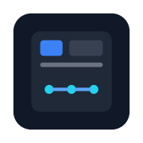

# feezal

<br><h3>Visually build MQTT-driven Apps and Dashboards</h3><br><br><br><br><br>

[](https://codecov.io/gh/feezal/feezal)

---

## Quickstart

```sh
docker run -d --name feezal -p 3000:3000 -v feezal-data:/data ghcr.io/feezal/feezal:latest
```

Then open [http://localhost:3000/editor/](http://localhost:3000/editor/) and follow the onboarding wizard.

---

## Features

- **WYSIWYG editor** — drag elements from the palette onto the canvas, resize and position them with your mouse
- **Source editing** — edit the view's HTML directly in a built-in code editor, with formatting and live round-tripping back to the canvas
- **Real-time data binding** — topic-based message routing connects any element attribute to a mqtt subscription
- **MQTT support** — direct browser-to-broker WebSocket connection; no backend required for the viewer
- **MQTT auto-discovery** — automatically detects devices published by e.g. Zigbee2MQTT, ESPHome, Frigate, evcc, RedMatic and compatible devices and bridges; one click pre-wires all topics and attributes.
- **Auto-generate apps and dashboards** - create full fledged apps with menu drawer and sub-views just with a few clicks. 
- **Web Components element model** — every palette element is a standard Custom Element; the ecosystem is distributed as plain npm packages
- **Composable elements** — turn a selection of elements into a named, reusable component with typed parameters: build once, instantiate many times, edit centrally and every instance follows
- **Responsive layouts** — layout elements (flex containers, responsive/app-shell wrappers, navbars) build fluid dashboards that adapt to any screen size, beyond fixed absolute positioning
- **Theme system** — swap the entire colour scheme at runtime via published theme packages
- **Static export** — one click produces a ZIP with a single `index.html` that has all JavaScript inlined; works on any static host or from `file://`
- **Progressive Web App** — installable, offline-capable dashboards that run full-screen and launch like a native app
- **Android & iOS apps** — export your dashboard as a Capacitor mobile-app project, with optional server-side Android APK builds
- **AI assistant** — a built-in chat that creates and edits dashboards for you; its agent tools search your live broker topics and discovered devices, so generated views arrive pre-wired to real data. Bring your own backend: Anthropic, OpenAI-compatible, or local Ollama


---

## Documentation

- [User Guide](docs/user-guide.md) — editor walkthrough, views, elements, MQTT patterns, themes, keyboard shortcuts and more
- [Development Guide](docs/development.md) — repo layout, dev setup, build pipeline, versioning and release process
- [Element Authoring Spec](docs/element-spec.md) — how to build and publish custom palette elements
- [Theme Authoring Spec](docs/theme-spec.md) — how to build and publish theme packages
- [Icon-Set Authoring Spec](docs/icons-spec.md) — how to build and publish icon-set packages
- [Roadmap](docs/ROADMAP.md) — planned features and design specs
- [Roadmap Archive](docs/roadmap-archive/README.md) — completed items, one file per item

---

## Credits

feezal stands on the shoulders of some excellent open-source work:

- [Lit](https://lit.dev) — every feezal element, the editor and the viewer are Lit components
- [MQTT.js](https://github.com/mqttjs/MQTT.js) — the MQTT client behind both the browser's direct broker connection and the server bridge
- [interact.js](https://interactjs.io) — drag, resize and snapping on the editor canvas
- [Express](https://expressjs.com) — the feezal server's HTTP framework (API, editor/viewer hosting, assets)
- [Socket.IO](https://socket.io) — the live editor/viewer ↔ server link relaying MQTT over WebSockets
- [Shoelace](https://shoelace.style) — the editor chrome's UI components (dialogs, inputs, dropdowns, …)
- [Material Design](https://m3.material.io) — [Material Web](https://github.com/material-components/material-web) components power the Material element family, and [Material Symbols](https://fonts.google.com/icons) are the built-in icon set
- [lottie-web](https://github.com/airbnb/lottie-web) — plays the vector animations behind the Fancy element family and the Lottie element
- [Monaco Editor](https://microsoft.github.io/monaco-editor/) — the editor's source view

Bundled icon sets that require attribution:

- [Font Awesome Free](https://fontawesome.com) icons by Fonticons, Inc. —
  [CC BY 4.0](https://creativecommons.org/licenses/by/4.0/)
- [KNX-UF icon set](https://knx-user-forum.de) by the KNX-User-Forum community —
  [CC BY-SA 3.0 DE](https://creativecommons.org/licenses/by-sa/3.0/de/deed.en)

The complete dependency tree ships as SPDX/CycloneDX SBOMs attached to every
[release](https://github.com/feezal/feezal/releases).

---

## License

feezal uses a two-tier licensing model:

- **Server and editor:** [AGPL-3.0-only](LICENSE) © Sebastian Raff
- **Element SDK (`@feezal/feezal-element`), all official elements and themes, and the
  viewer runtime bundled into static exports:** MIT

In practice: run feezal freely, self-host it, modify it — no strings attached beyond the
AGPL's share-alike terms. Your **exported dashboards are MIT-clean artifacts** you can
publish anywhere, and **community element packages are not affected by copyleft** — build
and distribute your own elements under any license you like
(see the [Element Authoring Spec](docs/element-spec.md)).

Contributions require signing the [FSFE Fiduciary License Agreement](CLA.md), which
contractually guarantees feezal will always remain Free Software — see
[CONTRIBUTING.md](CONTRIBUTING.md).
